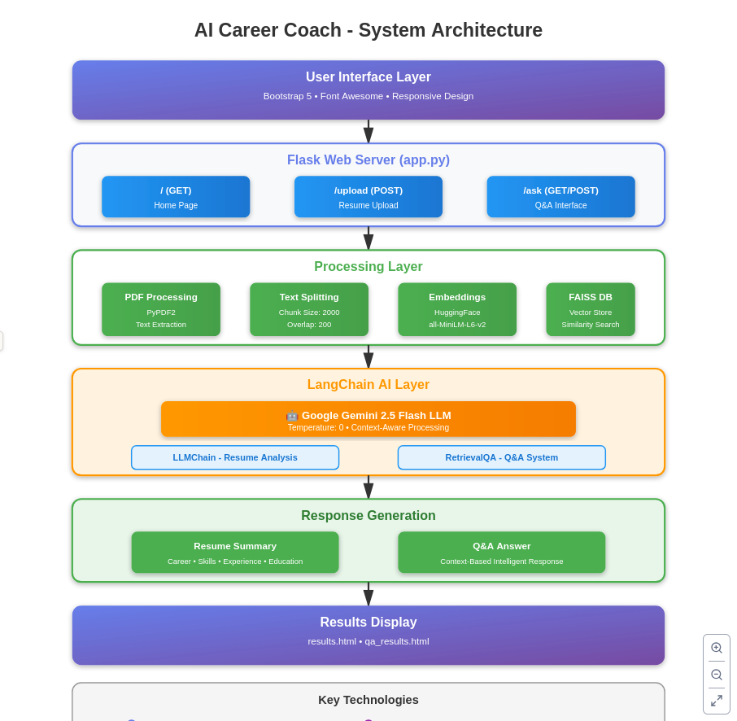

# 🤖 AI Career Coach

An intelligent Flask-based web application that analyzes resumes using AI and provides personalized career insights, recommendations, and interactive Q&A capabilities.


## 📋 Table of Contents

- [Features](#features)
- [System Architecture](#system-architecture)
- [Technology Stack](#technology-stack)
- [Installation](#installation)
- [Configuration](#configuration)
- [Usage](#usage)
- [Project Structure](#project-structure)
- [API Endpoints](#api-endpoints)
- [Contributing](#contributing)
- [License](#license)

## ✨ Features

### 🎯 Core Capabilities

- **Resume Analysis**: Upload PDF resumes and receive comprehensive AI-powered analysis
- **Career Insights**: Get detailed summaries including:
  - Career Objective
  - Skills and Expertise
  - Professional Experience
  - Educational Background
  - Notable Achievements
- **Interactive Q&A**: Ask specific questions about your resume and receive intelligent answers
- **Vector Search**: Advanced RAG (Retrieval Augmented Generation) for accurate context-based responses
- **Modern UI**: Beautiful, responsive web interface with gradient designs

## 🏗️ System Architecture

## 🏗️ System Architecture

<p align="center">
  
</p>

*Complete data flow from PDF upload through AI processing to intelligent results*
## 🛠️ Technology Stack

### Backend
- **Flask**: Web framework for Python
- **LangChain**: Framework for LLM applications
- **Google Gemini 2.5 Flash**: Large Language Model for analysis
- **PyPDF2**: PDF text extraction
- **FAISS**: Vector database for similarity search
- **HuggingFace**: Sentence transformers for embeddings

### Frontend
- **Bootstrap 5**: Responsive UI framework
- **Font Awesome 6**: Icon library
- **Custom CSS**: Gradient designs and animations

### Machine Learning
- **Sentence Transformers**: `all-MiniLM-L6-v2` model
- **Vector Embeddings**: 384-dimensional vectors
- **RAG Pipeline**: Retrieval Augmented Generation

## 📦 Installation

### Prerequisites

- Python 3.8 or higher
- pip package manager
- Google API Key (for Gemini)

### Step-by-Step Installation

1. **Clone the repository**
```bash
git clone https://github.com/yourusername/AI-Career-Coach.git
cd AI-Career-Coach
```

2. **Create a virtual environment**
```bash
python -m venv venv
source venv/bin/activate  # On Windows: venv\Scripts\activate
```

3. **Install dependencies**
```bash
pip install -r requirements.txt
```

4. **Set up environment variables**

Create a `.env` file in the root directory:
```env
GOOGLE_API_KEY=your_google_api_key_here
```

To get a Google API key:
- Visit [Google AI Studio](https://makersuite.google.com/app/apikey)
- Create a new API key
- Copy it to your `.env` file

5. **Create required directories**
```bash
mkdir uploads
```

## ⚙️ Configuration

### Environment Variables

| Variable | Description | Required |
|----------|-------------|----------|
| `GOOGLE_API_KEY` | Google Gemini API key | Yes |

### Application Settings

You can modify these in `app.py`:

- **Upload folder**: `UPLOAD_FOLDER = 'uploads'`
- **Text chunk size**: `chunk_size=2000`
- **Chunk overlap**: `chunk_overlap=200`
- **Model**: `model="gemini-2.5-flash"`
- **Temperature**: `temperature=0`
- **Similarity search results**: `search_kwargs={"k": 4}`

## 🚀 Usage

### Starting the Application

```bash
python app.py
```

The application will start on `http://localhost:5000`

### Using the Application

1. **Upload Resume**
   - Navigate to the home page
   - Click on the upload area or drag-and-drop your PDF resume
   - Wait for the AI analysis to complete

2. **View Analysis**
   - Review the comprehensive career analysis
   - Get insights on skills, experience, and achievements

3. **Ask Questions**
   - Click "Ask Questions About Resume"
   - Type your question in the text area
   - Get instant AI-powered answers

### Example Questions

- "What are my strongest technical skills?"
- "How can I improve my resume for software engineering roles?"
- "What career paths are suitable based on my experience?"
- "Should I add more projects to my resume?"

## 📁 Project Structure

```
AI-Career-Coach/
├── app.py                      # Main Flask application
├── requirements.txt            # Python dependencies
├── .env                        # Environment variables (create this)
├── README.md                   # Project documentation
├── uploads/                    # Uploaded PDF files
├── vector_index/               # FAISS vector database
└── templates/                  # HTML templates
    ├── index.html             # Home page
    ├── results.html           # Resume analysis results
    ├── ask.html               # Q&A interface
    ├── qa_results.html        # Q&A results
    └── query_results.html     # Alternative results page
```

## 🌐 API Endpoints

| Endpoint | Method | Description |
|----------|--------|-------------|
| `/` | GET | Home page with upload interface |
| `/upload` | POST | Upload and analyze resume PDF |
| `/ask` | GET, POST | Q&A interface and processing |

## 🔍 How It Works

### Resume Analysis Pipeline

1. **PDF Upload**: User uploads a PDF resume
2. **Text Extraction**: PyPDF2 extracts text from the PDF
3. **Text Splitting**: CharacterTextSplitter breaks text into chunks
4. **Embedding Generation**: HuggingFace model creates vector embeddings
5. **Vector Storage**: FAISS stores embeddings for quick retrieval
6. **LLM Analysis**: Gemini analyzes the resume using the prompt template
7. **Results Display**: Formatted analysis shown to user

### Q&A System

1. **Question Input**: User types a question
2. **Vector Search**: FAISS finds most relevant resume sections
3. **Context Retrieval**: Top 4 similar chunks retrieved
4. **Answer Generation**: Gemini generates answer based on context
5. **Response Display**: Answer shown with proper formatting

## 🤝 Contributing

Contributions are welcome! Please follow these steps:

1. Fork the repository
2. Create a feature branch (`git checkout -b feature/AmazingFeature`)
3. Commit your changes (`git commit -m 'Add some AmazingFeature'`)
4. Push to the branch (`git push origin feature/AmazingFeature`)
5. Open a Pull Request


## 🙏 Acknowledgments

- Google Gemini for powerful language model
- LangChain for LLM framework
- HuggingFace for sentence transformers
- FAISS for efficient vector search
- Bootstrap for beautiful UI components


